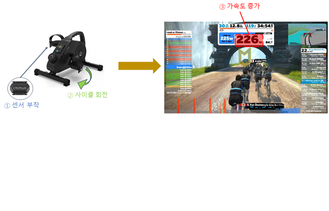

**본    문**     

​    

​    

I. 프로젝트 개요 

​    

​    

1. 프로젝트 소개

​    

|  |  | ![그림입니다. 원본 그림의 이름: mem000096980009.tmp 원본 그림의 크기: 가로 900pixel, 세로 634pixel]  (image/그림3.png) |
| ------------------------------------------------------------ | ------------------------------------------------------------ | ------------------------------------------------------------ |
|                                                              |                                                              |                                                              |

​    

• “반려동물과 함께 즐길수 있는 스마트 운동기구”

•  본 프로젝트는 동물과 사람이 야외(offline) 활동을 실내와 online 활동을 겸하여 이를 메타버스와 융합한 스마트 운동 기구이다.

​    

​    

​    

2. 개발 배경 및 필요성

​    

     

• 코로나 발생 시기에 사회적 거리 두기로 인하여 야외 활동에 제약이 발생하였다.

• 야외활동 제약으로 운동할 기회가 줄어 들었고, 반려동물도 활동량이 제약되고 있다.

• 소비자들은 실내 운동에 관심이 증가하였으며, 실내활동인 홈 트레이닝 시장이 증가하고 있다.

• 사람과 반려 동물이 함께 할 수 있는 운동 기구가 필요하다. 

• 실내 운동도 야외 활동과 같이 다양한 사람들과 함께하는 것이 필요하다.

• offline의 운동을 online 메타버스와 연동하여 다양한 사람들과 함께 운동을 할 수 있는 시스템이 필요하다.

3. 프로젝트 특·장점

​    

|  |  |
| ------------------------------------------------------------ | ------------------------------------------------------------ |
|                                                              |                                                              |

• 반려동물의 운동기와 사람의 운동기구를 결합하여, 이를 online 메타버스와 결합된 스마트 반려동물 운동기구이다.

• 반려동물과 함께 운동을 즐길 수 있다.

• 운동한 활동이 online과 메타버스와 연동이 된다.

​    

​    

​    

​    

​    

​    

​    

​    

​    

​    

​    

​    

​    

​    

​    

​    

​    

​    

II. 프로젝트 내용 

​    

1. 프로젝트 구성도 

​    

1) H/W 구성도

   • 캣휠: 동력부, 조작제어부, 동작감지센서로 구성된다.

    

​    

① 동력부

    

 • 아두이노 → 모터 드라이버로 모터 방향, 속도 값을 보낸다.

 • 모터 드라이버 → 모터로 그 값만큼 구동을 시킨다.

 • 파란색 화살표의 순서로 동력을 전달하여 캣휠을 회전시킨다.

② 조작제어부

  

 • ON/OFF스위치: 모터, 아두이노의전원을 제어한다.

 • PB(PushButton) 스위치: 모터 구동, 속도 제어를 한다.

 • LED: 모터 구동, 속도 제어 시 상태 여부를 점•소등으로 나타낸다.

 • LCD: 스위치와 LED 구동 시 해당 내용이 문구로 나타난다.

​    

③ 동작감지부

  )  

 • 초음파 센서를 통해 반려묘의 존재 유/무와 위치 변화를 감지한다.

​    

​    

​    

​    

​    

​    

​    

​    

​    

​    

​    

   (2) 사이클

|  |  |  |
| ------------------------------------------------------------ | ------------------------------------------------------------ | ------------------------------------------------------------ |
|                                                              |                                                              |                                                              |

  

 • 사이클은 캣휠과 동기화 되고 사이클이 동작하면 캣휠에게 신호를 준다.

 • 이러한 모듈은 교체가 가능하다.

​    

2) S/W 구성도

 • 캣휠의 동작을 감지한다.

 • 동작을 제어한다.

 • 스마트 기기(안드로이드)와 연동한다.

​    

3) 시스템 구성도

    

​    

2. 프로젝트 기능 

​    

1) 전체 기능 목록 

| **구분**       | **기능**                                                     | **설명**                                                     | **현재진척도****(%)** |
| -------------- | ------------------------------------------------------------ | ------------------------------------------------------------ | --------------------- |
| S/W            | Zwift                                                        | 자이로 센서를 이용하여 사이클과 캣휠의 가속도가 Zwift를 통해 구현된다.완성가능시점 (9/15) | 40%                   |
| 캣휠 앱        | 캣휠의 이동 거리, 모터 가동, 속도 조절 등을 확인할 수 있다.완성가능시점 (9/15) | 0%                                                           |                       |
| H/W            | 초음파 감지                                                  | 초음파 센서를 통해 캣휠 내 고양이 존재와 위치 변화에 따라 모터의 가동 여부를 제어한다.완성가능시점 (9/8) | 20%                   |
| 모터 속도 가변 | 캣휠의 모터 속도를 10단계로 나눠 고양이에게 적절한 속도로 조절한다.완성가능시점 (9/8) | 50%                                                          |                       |
| 상태창         | LCD를 이용하여 모터 구동 상태, 속도 상태 등의 정보를 표현한다.완성가능시점 (9/8) | 20%                                                          |                       |
| 하베스팅       | 사이클의 회전 에너지를 이용하여 에너지를 생산하고 저장한다.완성가능시점 (9/15) | 20%                                                          |                       |

​    

2) S/W 주요 기능 

| **기능** | **설명**                                                     | **프로젝트실물사진**                                         |
| -------- | ------------------------------------------------------------ | ------------------------------------------------------------ |
| Zwift    | 사이클의 페달이나 캣휠이 회전하면 그에 장착된 자이로 센서에 의해 가속도 값이 측정되어 Zwift로 보내진다. 그러면 우측의 핸드폰에 보여지는 것처럼 Zwift 앱 속 사람이 가속도 값만큼 움직이는 모션이 나타난다. |  |
| 캣휠 앱  | 인벤터 앱을 이용하여 캣휠의 탑승 거리, 모터 가동, 속도 조절 등을 확인할 수 있도록 구현한다. 블루투스를 통해 아두이노와 핸드폰이 연결되어 필요한 값을 전달하거나 받을 수 있다. | jpg) |

3) H/W 주요 기능 

| **기능****/****부품** | **설명**                                                     | **프로젝트실물사진**                                         |
| --------------------- | ------------------------------------------------------------ | ------------------------------------------------------------ |
| 초음파 감지           | 캣휠의 양 대각선에 달린 두 개의 초음파 센서를 통해 캣휠 내 고양이 존재를 파악하여 아두이노로 값을 전달한다. 모터 가동 시 고양이의 위치 변화량이 일정 값을 넘어가면 모터가 정지한다. |  |
| 모터 속도 가변        | 모터가 가동되면 1단계에서 10단계까지 조절이 가능하다.        |  |
| 상태창                | LCD를 이용하여 모터 구동 상태, 속도 상태 등의 정보를 표현한다 |  |
| 하베스팅              | 사이클의 회전 에너지를 이용하여 사이클과 연결된 동력전달장치를 통해 생산된 에너지가 배터리에 저장된다. |  |

​    

​    

​    

​    

3. 주요 적용 기술 

​    

​    

​    

​    

​    

​    

​    

​    

4. 프로젝트 개발 환경 

| **구분**         | **상세내용**             |                  |
| ---------------- | ------------------------ | ---------------- |
| S/W개발환경      | OS                       | Android          |
| 개발환경(IDE)    | Arduino IDE              |                  |
| 개발도구         | VS                       |                  |
| 개발언어         | C언어                    |                  |
| 기타사항         | •                        |                  |
| H/W구성장비      | 디바이스                 | 아두이노 우노    |
| 센서             | 초음파 센서, 자이로 센서 |                  |
| 통신             | I2C                      |                  |
| 언어             | Korean                   |                  |
| 기타사항         | 3D Tool(NX)              |                  |
| 프로젝트관리환경 | 형상관리                 | OneDrive, github |
| 의사소통관리     | 카카오톡 단체방          |                  |
| 기타사항         | •                        |                  |

​    

5. 기타 사항 [본문에서 표현되지 못한 프로젝트의 가치(Value)] 및 제작 노력

​    

​    • 제품이 많이 보급됨에 따라 주요 유통시설이었던 펫카페, 애견동반 헬스장 등 반려동물과 유대감을 쌓을 수 있는 시설이 많아짐

​    • 제품 가치 상승 그리고 애견동반 시설의 마케팅 활용 등 가치 상승의 기대감이 있다.

​    • 게임 시스템을 이용하여 카페 내 홍보 활용

​    • 스트레스 해소, 반려동물의 안정감

​    